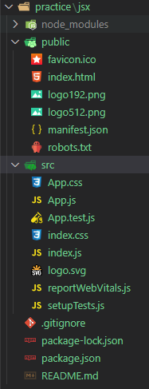

# ✔ '01.Let's Dive In!' 이론 정리


## ▶ 4. Let's Build an App!

- online editor(Code Sandbox)를 이용해서 **Translate App** 만들기
   - [Starter Code](https://codesandbox.io/s/react-pibc94)
   - [Finish Code](https://codesandbox.io/s/react-forked-m5bz37)


## ▶ 5. Critical Questions

### 🔹 React의 주된 목표

- 사용자들에게 HTML을 보여주고, 사용자들이 반응할 때(클릭, 드래그 등) HTML을 변화시켜 줌

### 🔹 React Component

- JSX를 반환하는 functions
- React에게 어떤 내용을 화면에 그려야 하는지 알려줌
- 한 project에는 수많은 Component로 구성되어 있음


## ▶ 6. A Few More Critical Questions

### 🔹 React Startup Process

1. projects 내 모든 JS 파일들이 하나의 파일(bundle.js 또는 App bundle)로 모인 후, 서버에 배치된다.
2. 사용자가 URL을 통해 서버에 request를 보내면 서버는 `index.html`과 `bundle.js`를 response한다.

   ```html
   <!-- index.html -->
   <!DOCTYPE html>
   <html lang="en">
     <head>
     </head>
     <body>
       <div class="container" id="root"></div>
     </body>
   </html>
   ```

   ```js
   // bundle.js
   // 아래 코드는 index.js 내에 있는 코드와 동일
   const rootElement = document.getElementById("root");  // a
   const root = createRoot(rootElement);                 // b
 
   root.render(<App />);                                 // c
   ```
  
   - 1) DOM에서 id가 'root'인 div태그를 찾는다
   - 2) root 요소를 react가 control하게 한다
   - 3) react는 App component의 JSX를 받아 HTML로 변환 후, root 요소에 렌더링한다

3. 사용자의 브라우저는 서버로부터 응답받은 코드를 실행시킨다.

### 🔹 `useState()` 함수

- React의 'state' system에 영향을 끼치는 함수
- state는 변수처럼 (시간에 따라 변화하는) data를 저장함
- **state가 변하면 react는 자동으로 화면에 content를 업데이트해줌**

### 🔹 Translate App에서 language에 따라 text를 translate할 수 있었던 이유

- Translate Component에서 Text와 Language를 입력받음
- text나 language의 state가 변할 때마다, Google Translate API에 네트워크 요청함
- 위 API를 통해 다른 언어로 변환된 text를 응답 받으면 화면에 그 결과를 표시하게 됨


## ▶ 7. Node Setup

- node.js가 설치된 상태인지 확인하는 법
   - 터미널에 아래 명령어를 입력하고 버전이 뜨면 이미 설치된 상태임
   - 만약 에러가 뜬다면 설치가 필요함
 
   ```bash
   $ node -v
   ```

- [node.js 공식 사이트](https://nodejs.org/ko/download/)에서 본인의 운영 체제에 따라 다운로드 받으면 됨 


## ▶ 8. Creating a React Project

> 실습: ['jsx' 이름의 React Project 만들기](https://github.com/hyejinny97/Modern-React-with-Redux/blob/master/1.Lets_Dive_in/practice/jsx)

- React Project 생성하는 법
  
   ```bash
   $ npx create-react-app <project명>
   ```

- Project 시작하는 법
   - 일단 나의 project 폴더 안으로 들어간 후, 터미널에 아래 명령어를 실행한다

   ```bash
   $ cd <project명>
   $ npm start
   ```

- Project 보는 법
   - 브라우저 URL 창에 `localhost:3000`를 입력한다

- Project를 종료하는 법
   - 터미널에서 `ctrl + C`를 누르면 project를 종료할 수 있다


## ▶ 9. What is Create React App?

### 🔹 Create-React-App

- JSX는 올바른 JS가 아니기 때문에 브라우저가 JSX를 실행시킬 수 없음
- 따라서, JSX를 유효한 JS로 변환하는 과정이 필요
- React Dev Server가 내부적으로 몇가지 tool을 실행해 자동으로 project 내 js 파일들을 하나의 파일(bundle.js)로 합쳐줌
   - Project 내에 있는 js 파일들 
   - → `Babel` tool을 통해 **JSX를 normal JS로 변환** 
   - → `Webpack` tool을 통해 **모든 파일들을 하나의 파일로 병합**
   - → single file (bundle.js)

### 🔹 React Project files and folders



- 대부분의 파일과 폴더는 기본 웹앱을 실행하는데 있어서 필요하지 않음
- React Application을 실행하는데 필요한 핵심 파일/폴더
   - `index.js`: app을 run할 때 첫번째로 실행되는 파일
   - `index.html`: react app 뼈대
   - `package.json`: list dependencies our app needs
   - `package-lock.json`: list dependencies our app needs
   - `node-modules`: contains dependencies our app needs